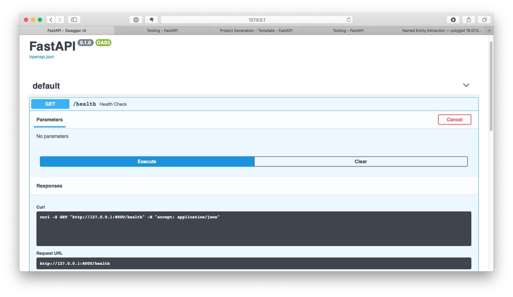
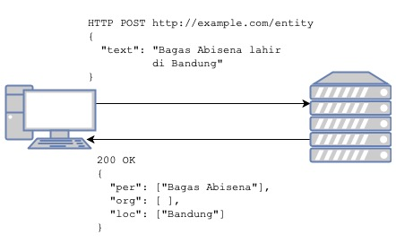

# 1 - Perkenalan REST API menggunakan framework FastAPI

## Persiapan

Buat dan aktifkan virtualenv. Sebagai contoh saya menggunakan conda env.

```bash
conda create -n docker-workshop python=3.7
conda activate docker-workshop
```

Di workshop ini, kami menggunakan framework [FastAPI](https://fastapi.tiangolo.com).
Sekarang install library `FastAPI` dan juga `uvicorn`, yang digunakan sebagai web server.

```bash
pip install fastapi uvicorn pytest requests
```

## Endpoint Pertama: Health Check

Saatnya membuat endpoint pertama, `/health`.
Endpoint health check bertujuan untuk mengecek apakah api server anda berjalan sebagaimana mestinya.

Pertama, kita buat file `api/main.py` dengan

```python
from fastapi import FastAPI

app = FastAPI()


@app.get('/health')
def health_check():
    return {'status': 'ok'}

```

Disini kita menyatakan bahwa setiap request `GET` ke endpoint `/health` akan ditangani oleh method `health_check`.

Untuk mengetes API yang sudah kita buat, kita jalankan web server uvicorn

```bash
cd api
uvicorn main:app --reload
```

Lalu buka browser anda ke [http://localhost:8000/health](http://localhost:8000/health).

Salah satu manfaat menggunakan FastAPI adalah adanya dokumentasi yang secara otomatis dihasilkan oleh framework ini.
Buka URL [http://localhost:8000/docs](http://localhost:8000/docs), anda akan disajikan halaman dokumentasi Swagger secara otomatis!



## Endpoint Kedua: NER

Sekarang kita akan buat endpoint untuk menunjang aplikasi utama kita. Aplikasi ini akan melakukan *named entity recognition* (NER) ke teks berbahasa Indonesia yang diberikan.
Hasilnya, kita akan mendapatkan daftar *named entity* berjenis orang (person atau per), tempat (location atau loc), dan organisasi (organisation atau org) yang ada di sebuah teks berbahasa Indonesia.
Perhatikan diagram berikut untuk lebih jelasnya.



### Instalasi

Untuk melakukan fungsi NER, kita akan menggunakan library [Polyglot](https://polyglot.readthedocs.io/en/latest/index.html). Pertama kita perlu melakukan instalasi package yang dibutuhkan. Untuk linux (ubuntu), lakukan perintah berikut:

```bash
sudo apt install gcc build-essential libicu-dev
conda install numpy nomkl
pip install polyglot pycld2 morfessor pyicu
```

Sedangkan untuk Mac, instalasi lebih mudah menggunakan conda

```bash
conda install -c conda-forge pyicu morfessor icu numpy
pip install pycld2 polyglot
```

Berikutnya, kita memerlukan file embedding dan model yang diperlukan untuk menjalankan fungsi NER. Buka terminal dan eksekusi perintah berikut:

```bash
polyglot download embeddings2.id ner2.id
```

### Development

Untuk memulai proses pengembangan endpoint yang baru, kita buat file api/schema.py, dengan isi sbb

```python
from pydantic import BaseModel

class Sentence(BaseModel):
    text: str
```

Fungsi dari file schema ini akan dijelaskan lebih lanjut.

Setelah itu kita buat endpoint baru, `/entity`, di file `api/main.py` seperti endpoint sebelumnya. Kali ini kita menggunakan metode `POST`, karena disini kita butuh mengirimkan data dari client ke server API kita.

> HTTP memiliki beberapa metode: GET, POST, PUT, DELETE, OPTiONS, HEAD, TRACE, PATCH, CONNECT.
> Metode yang sering digunakan adalah GET, untuk meminta resource ke server. Misal web browser meminta file html untuk akan ditampilkan ke web server, atau client meminta resource berbentuk json ke API server.
> POST digunakan untuk mengirimkan data ke server. Login yang biasa kita lakukan di suatu website, menggunakan metode POST untuk mengirimkan informasi username dan password ke server.

```python
from polyglot.text import Text

from schema import News


@app.post('/entity')
def extract_entity(sentence: Sentence):
    text = Text(sentence.text)
    entities = {
        "per": [],
        "org": [],
        "loc": []
    }

    for ent in text.entities:
        if ent.tag == 'I-PER':
            entities['per'].append(' '.join(ent))
        elif ent.tag == 'I-LOC':
            entities['loc'].append(' '.join(ent))
        elif ent.tag == 'I-ORG':
            entities['org'].append(' '.join(ent))

    return entities
```

Semua pekerjaan berat NER dilakukan oleh library polyglot dengan menginstansiasi kelas `Text`.

Saatnya mencoba API yang sudah anda buat! Jika belum, jalankan server uvicorn

```bash
uvicorn main:app
```

lalu buka browser, navigasi ke `http://localhost:8000`, klik tombol `Try it out` di bagian POST /entity,
coba masukkan json dengan format seperti di bawah di dalam kolom `Request body`.

```json
{
    "text": "text yang ingin anda ekstrak named entity-nya"
}
```

Setelah itu lihat hasil response dari API server di bagian server response, kita akan lihat data respon API kita dalam bentuk JSON.


## Validasi

Mari kita kembali ke file `api/schema.py`. Apa gunanya kita membuat file tersebut?

Salah satu tugas utama API server adalah melakukan validasi akan data yang dikirimkan ke server, agar sesuai dengan spek yang diinginkan. Analoginya seperti ketika kita hendak membuat akun baru di sebuah website. Server akan melakukan beberapa validasi, seperti:

* mengecek apakah username kita masih tersedia
* mengecek apakah password kita sesuai spek keamanan

Hal yang sama bisa dilakukan dengan data JSON yang dikirimkan melalui API. Validasi merupakan fungsi yang sangat penting, karena selama sebuah entitas mempunyai hak akses ke sebuah endpoint, maka dia bisa mengirimkan data apapun. Validasi ini memastikan bahwa data yang dikirimkan adalah benar.

Melalui baris

```python
# main.py
@app.post('/entity')
def extract_entity(sentence: Sentence):

# schema.py
class Sentence(BaseModel):
    text: str
```

kita menyatakan bahwa endpoint `/entity` siap menerima data berupa object Sentence, dimana object tersebut (di file schema.py) mempunyai satu field bernama `text`, yang bertipe string.

FastAPI akan secara otomatis melakukan invalidasi apabila data yang dikirimkan salah, misal:

* JSON tidak mengandung field text
* field text tidak bertipe str

Mari kita coba

```bash
curl -X POST "http://127.0.0.1:8000/entity" -H "accept: application/json" -H "Content-Type: application/json" -d "{}"
```

Output:
```bash
{"detail":[{"loc":["body","sentence","text"],"msg":"field required","type":"value_error.missing"}]
```

```bash
curl -X POST "http://127.0.0.1:8000/entity" -H "accept: application/json" -H "Content-Type: application/json" -d "{\"text\":null}"
```

Output:
```bash
{"detail":[{"loc":["body","sentence","text"],"msg":"none is not an allowed value","type":"type_error.none.not_allowed"}]}
```

Semua fungsi validasi ini disediakan oleh FastAPI selama kita menyatakan schema yang sesuai.

## Test

Sebagai developer yang baik, kita perlu menyiapkan kode test untuk setiap fungsi API yang kita rancang.
FastAPI memudahkan kita untuk melakukan test.

Kita hanya perlu menggunakan `TestClient`, lalu instansiasi dengan app yang sudah kita definisikan sebelumnya. Dengan test client tersebut, kita melakukan simulasi pemanggilan API, lalu kita cek apakah respon dari API sudah sesuai.

Berikut contohnya (disini kita menggunakan library test `pytest`). Contoh lebih lengkap bisa dilihat di file `api/test_api.py`.

```python
from starlette.testclient import TestClient
import pytest

from main import app

@pytest.fixture
def client():
    return TestClient(app)


def test_health_check(client: TestClient):
    resp = client.get('/health')
    assert resp.status_code == 200
    assert resp.json() == {'status': 'ok'}
```
