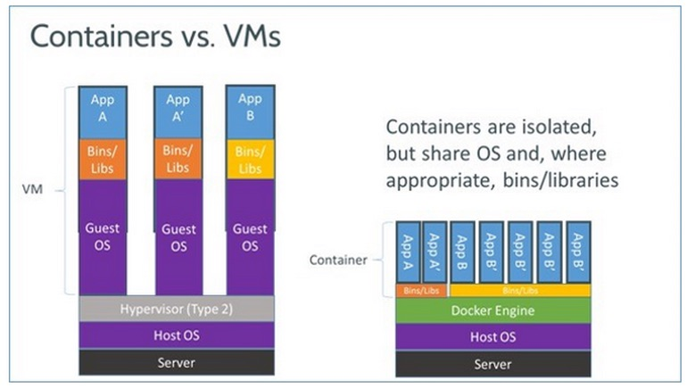

# 2 - Mengemas API dengan Docker

## Latar Belakang

Di bagian sebelumnya, kita sudah berhasil mengembangkan API untuk melakukan NER. Sekarang bayangkan dua skenario ini:

* anda diminta mendeploy API yang sudah anda buat ke server ubuntu di AWS
* kolega di kantor ingin melanjutkan pengembangan API tersebut di laptopnya sendiri

Di dua skenario itu, maka anda harus mengulangi langkah-langkah yang sudah anda lakukan sebelumnya seperti di bawah ini

1. Memastikan versi ubuntu antara laptop yang digunakan untuk pengembangan sama dengan server untuk production
2. Install library ubuntu yang diperlukan dengan `apt install`
3. Install python dengan versi yang sama
4. Install library python yang diperlukan dengan `pip`
5. Jalankan web server uvicorn dengan background process seperti supervisord atau systemd

Jika anda harus melakukan instalasi API kita di banyak server, tentunya hal tersebut akan sangat melelahkan dengan rentan dengan kesalahan. Dan di era sistem terdistribusi seperti sekarang, sangat dimungkinkan sebuah aplikasi diinstall di banyak server, misal untuk melayani kebutuhan trafik yang tinggi.

Akan lebih baik apabila langkah 1-5 diatas bisa anda 'rekam', sehingga anda bisa menjalankan API server anda secara mudah di banyak tempat. Hal ini dimungkinkan dengan adanya Docker.

## Docker

Secara sederhana, Docker bisa dianggap sebagai sebuah komputer di dalam komputer. Namun enaknya, 'komputer virtual' ini bisa dengan mudah anda bagikan ke teman anda, dan teman anda bisa menjalankan program yang sama dengan sama mudahnya.

Jika anda akrab dengan konsep *virtual machine* (VM), maka Docker sedikit banyak mempunyai kesamaan dengan VM, dimana keduanya memberikan isolasi terhadap program yang anda buat. Bedanya, Docker hanya melakukan isolasi di level aplikasi, sedangkan VM di level OS.

> Secara teknis, Docker merupakan implementasi dari teknologi
> bernama container. Selain Docker, ada juga [alternatif](https://containerjournal.com/topics/container-ecosystems/5-container-alternatives-to-docker/) lain seperti lxc, coreOS rkt, dan Mesos. Bisa dianggap Docker dengan container itu layaknya Aqua dan air mineral karena kepopulerannya.



Lalu apa konsekuensinya? Secara sederhana, Docker/container  lebih ringan dan portabel dibandingkan VM.

## Docker Image dan Docker Container

Saatnya 'membungkus' aplikasi API kita dengan Docker. Sebelum mulai, kita perlu kuasai dulu dua konsep penting dari Docker:

* Docker image
* Docker container

Mudahnya begini, docker image itu resep makanan, sedangkan docker container itu makanan yang sudah dimasak. Anda bisa memasak 1 piring, 2 piring, 1000 piring, tidak masalah, yang penting anda menggunakan resep yang sama. Sama dengan Docker. Anda bisa menjalankan 10 container yang berasal dari image Ubuntu versi 18.04 dan tiap-tiap container tersebut berdiri sendiri.

Yang perlu diperhatikan, tiap container mempunyai file system sendiri, layaknya sebuah VM, yang saling terisolasi dari container lainnya.
Yang berbeda dari VM, file system dari container bersifat non-permanen, artinya ketika anda stop atau restart sebuah container, seluruh data yang ada di container akan hilang, digantikan dengan data terakhir yang terekam di dalam image.

Layaknya resep, anda juga bisa memodifikasi Docker image sesuai selera anda. Misal anda suka ayam geprek, tapi anda merasa lebih enak lagi kalau ayam geprek tersebut diguyur dengan coca-cola, sehingga menjadi ayam geprek kola. Anda bisa mulai dengan resep ayam geprek sebagai *base*, lalu anda tambahkan instruksi anda sendiri sampai ayam geprek tadi menjadi ayam geprek kola.

Saya harap sekarang anda sudah paham dengan konsep Docker.
Cukup dengan teori sekarang saatnya praktik!

## Membuat Docker Image untuk API kita

Anda bisa menjalankan sebuah docker container dengan image yang sudah ada, atau memodifikasi image yang ada.
Kita akan melakukan opsi kedua. Untuk membuat image kita sendiri, kita perlu membuat sebuah file `Dockerfile`.
Taruh file tersebut di folder `api`.

Kita mulai dengan memilih base image yang kita butuhkan.
Karena API kita berbasis python 3.7, kita bisa menggunakan
base image python versi 3.7, lalu kita tambakan komponen-komponen aplikasi kita kesana.

```dockerfile
FROM python:3.7
```

Setiap image selalu mempunyai format penamaan `<nama>:<tag>`.

Jika anda mengabaikan `tag`, maka secara default diberikan image dengan tag `latest`. Tag biasanya digunakan untuk menandakan versi dari base image. tag 3.7 menandakan versi 3.7 dari python.

Berikutnya kita install library yang dibutuhkan.
Karena image python berbasis linux Debian (yang mana Ubuntu merupakan turunan dari debian), maka kita bisa menggunakan `apt install`.

```dockerfile
RUN apt update -yqq && apt upgrade -yqq && apt install -yqq \
