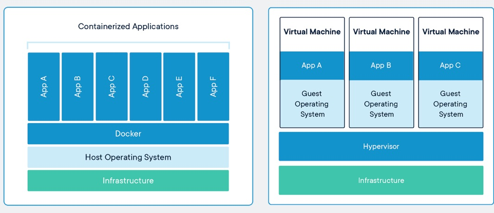

# 2 - Mengemas APINER dengan Docker

## Latar Belakang

Di bagian sebelumnya, kita sudah berhasil mengembangkan API untuk melakukan NER. Sekarang bayangkan dua skenario ini:

* anda diminta mendeploy API yang sudah anda buat ke server ubuntu di AWS
* kolega di kantor ingin melanjutkan pengembangan API tersebut di laptopnya sendiri

Di dua skenario itu, maka anda harus mengulangi langkah-langkah yang sudah anda lakukan sebelumnya seperti di bawah ini

1. Memastikan versi ubuntu antara laptop yang digunakan untuk pengembangan sama dengan server untuk production
2. Install library ubuntu yang diperlukan dengan `apt install`
3. Install python dengan versi yang sama
4. Install library python yang diperlukan dengan `pip`
5. Jalankan web server uvicorn dengan background process seperti supervisord atau systemd

Jika anda harus melakukan instalasi API kita di banyak server, tentunya hal tersebut akan sangat melelahkan dengan rentan dengan kesalahan. Dan di era sistem terdistribusi seperti sekarang, sangat dimungkinkan sebuah aplikasi diinstall di banyak server, misal untuk melayani kebutuhan trafik yang tinggi.

Akan lebih baik apabila langkah 1-5 diatas bisa anda 'rekam', sehingga anda bisa menjalankan API server anda secara mudah di banyak tempat. Hal ini dimungkinkan dengan adanya Docker.

## Docker

Secara sederhana, Docker bisa dianggap sebagai sebuah komputer di dalam komputer. Namun enaknya, 'komputer virtual' ini bisa dengan mudah anda bagikan ke teman anda, dan teman anda bisa menjalankan program yang sama dengan sama mudahnya.

Jika anda akrab dengan konsep *virtual machine* (VM), maka Docker sedikit banyak mempunyai kesamaan dengan VM, dimana keduanya memberikan isolasi terhadap program yang anda buat. Bedanya, Docker hanya melakukan isolasi di level aplikasi, sedangkan VM di level OS.

> Secara teknis, Docker merupakan implementasi dari teknologi
> bernama container. Selain Docker, ada juga [alternatif](https://containerjournal.com/topics/container-ecosystems/5-container-alternatives-to-docker/) lain seperti lxc, coreOS rkt, dan Mesos. Bisa dianggap Docker dengan container itu layaknya Aqua dan air mineral karena kepopulerannya.


sumber: https://www.docker.com/resources/what-container

Lalu apa konsekuensinya? Secara sederhana, Docker/container  lebih ringan dan portabel dibandingkan VM.

## Docker Image dan Docker Container

Saatnya 'membungkus' aplikasi API kita dengan Docker. Sebelum mulai, kita perlu kuasai dulu dua konsep penting dari Docker:

* Docker image
* Docker container

Mudahnya begini, docker image itu resep makanan, sedangkan docker container itu makanan yang sudah dimasak. Anda bisa memasak 1 piring, 2 piring, 1000 piring, tidak masalah, yang penting anda menggunakan resep yang sama. Sama dengan Docker. Anda bisa menjalankan 10 container yang berasal dari image Ubuntu versi 18.04 dan tiap-tiap container tersebut berdiri sendiri.

Yang perlu diperhatikan, tiap container mempunyai file system sendiri, layaknya sebuah VM, yang saling terisolasi dari container lainnya.
Yang berbeda dari VM, file system dari container bersifat non-permanen, artinya ketika anda stop atau restart sebuah container, seluruh data yang ada di container akan hilang, digantikan dengan data terakhir yang terekam di dalam image.

Layaknya resep, anda juga bisa memodifikasi Docker image sesuai selera anda. Misal anda suka ayam geprek, tapi anda merasa lebih enak lagi kalau ayam geprek tersebut diguyur dengan coca-cola, sehingga menjadi ayam geprek kola. Anda bisa mulai dengan resep ayam geprek sebagai *base*, lalu anda tambahkan instruksi anda sendiri sampai ayam geprek tadi menjadi ayam geprek kola.

Saya harap sekarang anda sudah paham dengan konsep Docker.
Cukup dengan teori, sekarang saatnya praktik!

## Dockerfile

Anda bisa menjalankan sebuah docker container dengan image yang sudah ada, atau memodifikasi image yang ada.
Kita akan melakukan opsi kedua. Untuk membuat image kita sendiri, kita perlu membuat sebuah file `Dockerfile`.
Taruh file tersebut di folder `api`.

Kita mulai dengan memilih base image yang kita butuhkan.
Karena API kita berbasis python 3.7, kita bisa menggunakan
base image python versi 3.7, lalu kita tambakan komponen-komponen aplikasi kita kesana.

```dockerfile
FROM python:3.7
```

Setiap image selalu mempunyai format penamaan `<nama>:<tag>`.

Jika anda mengabaikan `tag`, maka secara default diberikan image dengan tag `latest`. Tag biasanya digunakan untuk menandakan versi dari base image. tag 3.7 menandakan versi 3.7 dari python.

Berikutnya kita install library yang dibutuhkan.
Karena image python berbasis linux Debian (yang mana Ubuntu merupakan turunan dari debian), maka kita bisa menggunakan `apt-get install`, lalu instalasi package dengan pip.

```dockerfile
RUN apt-get update -yqq \
    && apt-get upgrade -yqq \
    && apt-get install -yqq --no-install-recommends \
        gcc build-essential libicu-dev

RUN pip install numpy fastapi pytest uvicorn \
    requests pytest polyglot pycld2 morfessor pyicu

RUN polyglot download --quiet embeddings2.id ner2.id
```

Simbol `&&` menggabungkan beberapa command untuk dijalankan dalam satu `RUN`. Simbol `\` memecah command ke beberapa baris agar lebih rapi.

Tahap berikutnya adalah menyalin berkas kode kita ke dalam container. Seperti yang sudah dijelaskan sebelumnya, docker container mempunyai file system tersendiri yang terisolasi dari host OSnya. File system tersebut 'direkam' dalam image yang kita buat. Oleh karena itu kita perlu menyalin source code yang ada di laptop kita (sebagai host), ke dalam container. Kita melakukan prosedur tersebut dengan command `COPY`.

Command `WORKDIR` yang dijalankan berikutnya berfungsi untuk menyetel *working directory* dari sebuah image. Dengan menyetel `WORKDIR` ke `/app`, semua command seperti `RUN`, `COPY`, `CMD` akan dilakukan di dalam folder `/app`.

```dockerfile
COPY . /app
WORKDIR /app
```

Command `EXPOSE` akan membuka port 8000 untuk container ketika dijalankan.

```dockerfile
EXPOSE 8000
```

CMD adalah definisi program yang akan dijalankan ketika container dijalankan. Jika anda perhatikan, baris `CMD` yanf kita definisikans sama dengan baris ketika kita menjalankan server uvicorn secara manual di tutorial sebelumnya. 

```dockerfile
CMD ["uvicorn", "main:app", "--host", "0.0.0.0", "--port", "8000"]
```

Saat ini Dockerfile kita sudah lengkap, saatnya kita build image kita.

## Build Image

Untuk membuat docker image dari Dockerfile, kita menjalankan command `docker image build`. Lengkapnya

```bash
docker image build -t <nama image>:<tag> <lokasi dockerfile>
```

Untuk aplikasi kita, berikut commandnya

```bash
docker image build -t apiner:latest .
```

Anda akan melihat output seperti layaknya kita melakukan instalasi program secara manual di komputer ubuntu.

```plain
Sending build context to Docker daemon  28.67kB

Step 1/8 : FROM python:3.7
 ---> 879165535a54
Step 2/8 : RUN apt-get update -yqq     && apt-get upgrade -yqq     && apt-get install -yqq --no-install-recommends         gcc build-essential libicu-dev
 ---> Running in 3cf792b3b447
debconf: delaying package configuration, since apt-utils is not installed
Preparing to unpack .../base-files_10.3+deb10u3_amd64.deb ...
Unpacking base-files (10.3+deb10u3) over (10.3+deb10u2) ...
Setting up base-files (10.3+deb10u3) ...
Installing new version of config file /etc/debian_version ...
...
Preparing to unpack .../00-openssh-client_1%3a7.9p1-10+deb10u2_amd64.deb ...
Unpacking openssh-client (1:7.9p1-10+deb10u2) over (1:7.9p1-10+deb10u1) ...
Preparing to unpack .../01-comerr-dev_2.1-1.44.5-1+deb10u3_amd64.deb ...
Unpacking comerr-dev:amd64 (2.1-1.44.5-1+deb10u3) over (2.1-1.44.5-1+deb10u2) ...
...
Setting up libgnutls-dane0:amd64 (3.6.7-4+deb10u2) ...
Setting up libgnutls-openssl27:amd64 (3.6.7-4+deb10u2) ...
...
Unpacking build-essential (12.6) ...
Setting up build-essential (12.6) ...
Removing intermediate container 3cf792b3b447
 ---> 207e57dc16b0
Step 3/8 : RUN pip install numpy fastapi pytest uvicorn     requests pytest polyglot pycld2 morfessor pyicu
 ---> Running in 5e371a88ff69
Collecting numpy
  Downloading numpy-1.18.1-cp37-cp37m-manylinux1_x86_64.whl (20.1 MB)
Collecting fastapi
  Downloading fastapi-0.48.0-py3-none-any.whl (43 kB)
...
Building wheels for collected packages: polyglot, pycld2, pyicu, starlette, httptools
  Building wheel for polyglot (setup.py): started
  Building wheel for polyglot (setup.py): finished with status 'done'
  Created wheel for polyglot: filename=polyglot-16.7.4-py2.py3-none-any.whl size=52557 sha256=41c714927ae98950914451016c30928325f8a1c71fcaea97f5e7ac7b2c612f6e
  Stored in directory: /root/.cache/pip/wheels/09/bc/67/75c9de8e9726460bc0b101ad225ad025cb8ce9e0759beb9d52
...
Successfully built polyglot pycld2 pyicu starlette httptools
Installing collected packages: numpy, pydantic, starlette, fastapi, attrs, zipp, importlib-metadata, pluggy, more-itertools, pyparsing, six, packaging, wcwidth, py, pytest, click, httptools, h11, websockets, uvloop, uvicorn, urllib3, chardet, certifi, idna, requests, polyglot, pycld2, morfessor, pyicu
Successfully installed attrs-19.3.0 certifi-2019.11.28 chardet-3.0.4 click-7.0 fastapi-0.48.0 h11-0.9.0 httptools-0.0.13 idna-2.8 importlib-metadata-1.5.0 more-itertools-8.2.0 morfessor-2.0.6 numpy-1.18.1 packaging-20.1 pluggy-0.13.1 polyglot-16.7.4 py-1.8.1 pycld2-0.41 pydantic-1.4 pyicu-2.4.2 pyparsing-2.4.6 pytest-5.3.5 requests-2.22.0 six-1.14.0 starlette-0.12.9 urllib3-1.25.8 uvicorn-0.11.2 uvloop-0.14.0 wcwidth-0.1.8 websockets-8.1 zipp-2.2.0
Removing intermediate container 5e371a88ff69
 ---> 6740fc95b1e2
Step 4/8 : RUN polyglot download --quiet embeddings2.id ner2.id
 ---> Running in f6d52c4fc03e
Removing intermediate container f6d52c4fc03e
 ---> ec08bd72265b
Step 5/8 : COPY . /app
 ---> b88906f93834
Step 6/8 : WORKDIR /app
 ---> Running in d9ad4e630bb3
Removing intermediate container d9ad4e630bb3
 ---> c03f345a5a66
Step 7/8 : EXPOSE 8000
 ---> Running in 4f8d35d5ceac
Removing intermediate container 4f8d35d5ceac
 ---> cc0e2689671e
Step 8/8 : CMD ["uvicorn", "main:app", "--host", "0.0.0.0", "--port", "8000"]
 ---> Running in a364dc7ebf3c
Removing intermediate container a364dc7ebf3c
 ---> 15be27c2fbf0
Successfully built 15be27c2fbf0
Successfully tagged apiner:latest
```

Cek daftar docker image yang ada dengan

```bash
docker image ls
```

## Layers

Nah, sekarang coba build ulang image dengan command yang sama.
Apa yang terjadi?

```bash
docker image build -t apiner:latest .
```

Ternyata build menjadi jauh lebih cepat, dan muncul kata `Using cache`. Apa maksudnya?

```plain
Sending build context to Docker daemon  46.59kB

Step 1/8 : FROM python:3.7
 ---> 879165535a54
Step 2/8 : RUN apt-get update -yqq     && apt-get upgrade -yqq     && apt-get install -yqq --no-install-recommends         gcc build-essential libicu-dev
 ---> Using cache
 ---> 207e57dc16b0
Step 3/8 : RUN pip install numpy fastapi pytest uvicorn     requests pytest polyglot pycld2 morfessor pyicu
 ---> Using cache
 ---> 6740fc95b1e2
Step 4/8 : RUN polyglot download --quiet embeddings2.id ner2.id
 ---> Using cache
 ---> ec08bd72265b
Step 5/8 : COPY . /app
 ---> 91f0bd164cb5
Step 6/8 : WORKDIR /app
 ---> Running in dd1325208f57
Removing intermediate container dd1325208f57
 ---> ad68565fa0b0
Step 7/8 : EXPOSE 8000
 ---> Running in 6b38a3643dbe
Removing intermediate container 6b38a3643dbe
 ---> 85017d0231fe
Step 8/8 : CMD ["uvicorn", "main:app", "--host", "0.0.0.0", "--port", "8000"]
 ---> Running in 84e814cb0698
Removing intermediate container 84e814cb0698
 ---> 1600503691f7
Successfully built 1600503691f7
Successfully tagged apiner:latest
```

Jadi, docker image dibuat dengan menumpuk beberapa lapisan / *layers*,
dimana setiap command di Dockerfile itu sejatinya membentuk layer.

> Layer bisa dianggap kumpulan files yang dihasilkan oleh command yang di run

Contohnya di Dockerfile yang sudah kita buat.
Kalau kita lihat log hasil build image, Docker image kita memiliki 8 layer,
dimana setiap layer mempunyai ID yang dihasilkan secara acak.

Pertama kita mulai dengan layer dari base image yang kita pakai, yaitu python:3.7,
lalu layer tersebut ditumpuk dengan file yang dihasilkan oleh command `RUN apt-get` kita.
Berikutnya, layer ditambah dengan file hasil dari `RUN pip install`.
Dan seterusnya sampai image selesai dibuat dengan layer paling atas yaitu CMD.

```plain
+--------------------------------------+
|            container layer           |
+--------------+-----------------------+
| 1600503691f7 | CMD uvicorn main:app  |
+--------------+-----------------------+
| 85017d0231fe | EXPOSE 8000           |
+--------------+-----------------------+
| ad68565fa0b0 | WORKDIR /app          |
+--------------+-----------------------+
| 91f0bd164cb5 | RUN COPY /app         |
+--------------+-----------------------+
| ec08bd72265b | RUN polyglot download |
+--------------+-----------------------+
| 6740fc95b1e2 | RUN pip install       |
+--------------+-----------------------+
| 207e57dc16b0 | RUN apt-get install   |
+--------------+-----------------------+
| 879165535a54 | python:3.7            |
+--------------+-----------------------+
```

Layer-layer inilah yang membentuk sebuah Docker image, dan ketika anda share image anda, layer-layer ini yang akan di-push ke image registry. Karena layer-layer ini bisa dipakai ulang / *reuse*, hal ini yang menyebabkan ketika anda build ulang image anda, build menjadi lebih cepat, karena tidak ada perubahan di layer yang sudah dibuat sebelumnya.

Sekarang coba ubah Dockerfile anda, ganti port di bagian EXPOSE dan CMD menjadi 8001, kira-kira apa yang terjadi?
Yang terjadi adalah Docker hanya akan menjalankan build di layer EXPOSE dan CMD, sedangkan layer-layer sebelumnya menggunakan cache yang sudah ada.

## Menjalankan Docker Container dari Docker Image

Untuk menjalankan Docker container, gunakan command `docker container run`. Syntax lengkap

```bash
docker container run [OPTIONS] IMAGE [COMMAND] [ARG...]
```

Coba jalankan command di bawah untuk menjalankan docker container dari docker image `apiner` yang sudah kita buat

```bash
docker container run --name apiner -p 8000:8000 apiner:latest
```

API bisa diakses melalui [http://localhost:8000](http://localhost:8000), seperti biasa.

Beberapa option yang penting:

* `--name`: memberikan nama ke container, jika tidak maka nama akan diberikan secara acak
* `-p`: mapping port di host ke port di container. Disini kita menyatakan bahwa port 8000 di host (laptop kita) kita mapping ke port 8000 di container. Tanpa option ini, kita tidak akan bisa mengakses API kita, walaupun di `Dockerfile` sudah kita `EXPOSE` port 8000.
* `-d`: menjalankan container di background
* `--rm`: langsung menghapus container setelah container berhenti
* `-it`: menjalankan mode interaktif
* -e: setel environment variable
* -v: mapping volume di host dengan container

Coba beberapa option diatas untuk melihat efek dari tiap pilihan.

Secara default, container akan menjalankan command yang didefinisikan dengan `CMD` pada `Dockerfile`. Dalam hal ini, kita akan menjalankan `uvicorn main:app ...`

Anda bisa memasukkan parameter setelah nama image di `docker container run`, misal

```bash
docker container run --rm -it apiner:latest ls -l /app
```

Di contoh diatas, anda akan menjalankan `ls -l /app`, bukan command default `uvicorn main:app`. Silakan dicoba.

## Sharing Docker Image ke Registry

Hal yang membuat container populer adalah karena sifatnya yang portabel. Anda bisa dengan mudah menjalankan image yang sudah dibuat orang lain. Sekarang kita akan coba mengunggah image yang sudah kita buat ke *registry*

> Sebagai contoh kita akan menggunakan private regisry hukumonline.
> Bagi pembaca non hukumonline, bisa menggunakan regisry publik dockerhub.

Jalankan

```bash
docker login <url registry>
```

login dengan akun LDAP anda, lalu lakukan `docker image push` untuk menggunggah image

```bash
docker image push <url registry>/<nama image>:<tag>
```

misal, kita bisa upload image dengan

```bash
docker image push registry.hukumonline.com/hol/apiner:latest
```

Untuk mengunduh, gunakan `docker image pull`

```bash
docker image pull registry.hukumonline.com/hol/apiner:latest
```