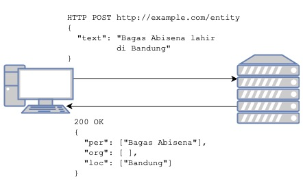

# Workshop Membuat REST API berbasis Python dengan Docker

Workshop ini saya buat untuk Hukumonline, terutama untuk teman-teman data engineer. Tujuan utama workshop ini ada tiga:

1. Mengajarkan bagaimana membuat REST API dengan pattern background worker
2. Membiasakan pengembangan aplikasi dengan Docker
3. Mengajarkan deployment aplikasi multi container dengan Docker compose dan AWS ECS

## Intro

Di Hukumonline, tim data engineer bekerja secara eksklusif menggunakan Python.
Kami menemukan banyak kasus dimana aplikasi atau servis yang kami buat harus dipakai oleh tim lain, misal tim backend, yang tidak bekerja dengan Python.
Disinilah API berguna. Aplikasi python kami bungkus dengan API sehingga bisa diakses menggunakan panggilan REST. Di workshop ini kami akan menggunakan framework [FastAPI](https://fastapi.tiangolo.com).

Setelah aplikasi dibuat, tentu kami harus men-*deploy* aplikasi tersebut ke *production*. Disini kami menggunakan Docker sebagai solusi *deployment*. Aplikasi REST API yang akan digunakan sebagai contoh di workshop ini cocok untuk menggambarkan skenario dunia nyata. Aplikasi contoh yang akan dikembangkan membutuhkan lebih dari satu Docker container. Oleh karena itu dibutuhkan solusi untuk men-*deploy* beberapa container tersebut sebagai satu kesatuan. Konsep ini lazim disebut *orchestration*. Kita akan mulai dengan deployment di satu mesin menggunakan *docker compose*, lalu akan dilanjutkan dengan orkestrasi multi-server menggunakan AWS Elastic Container Service (ECS).

Workshop ini dibuat sesuai kebutuhan tim di Hukumonline, namun materi ini saya desain seumum mungkin agar bisa bermanfaat untuk pembaca lain. Semoga bermanfaat!

## Aplikasi

Kita akan membuat aplikasi yang akan kita namakan APINER: API untuk named entity recognition.
Aplikasi ini akan melakukan *named entity recognition* (NER) ke teks berbahasa Indonesia yang diberikan.
Hasilnya, kita akan mendapatkan daftar *named entity* berjenis orang (person atau per), tempat (location atau loc), dan organisasi (organisation atau org) yang ada di sebuah teks berbahasa Indonesia.
Perhatikan diagram berikut untuk lebih jelasnya.

## Materi

Materi workshop dikemas dalam beberapa post berikut:

1. [Perkenalan REST API menggunakan framework FastAPI](1-Intro-FastAPI.md)
2. [Mengemas API dengan Docker](2-Dockerise.md)
3. [Improvisasi API dengan background worker berbasis Celery](3-Worker.md)
4. [Deployment menggunakan docker-compose](4-Docker-Compose.md)
5. [Deployment menggunakan AWS ECS](5-AWS-ECS.md)